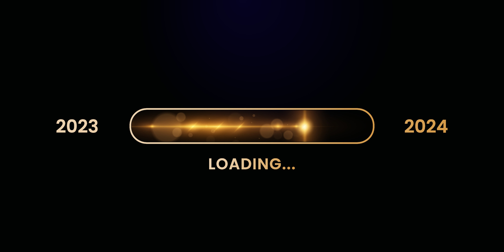
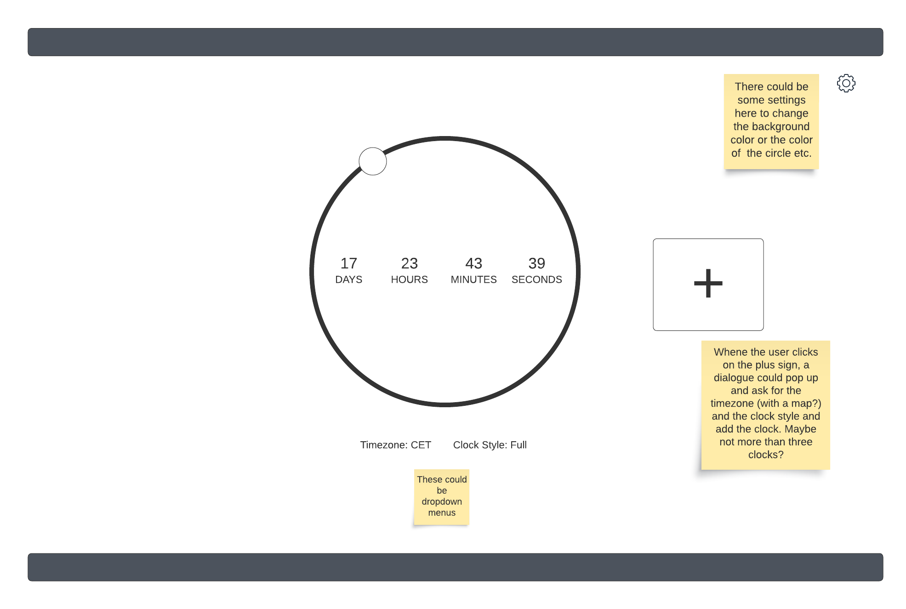
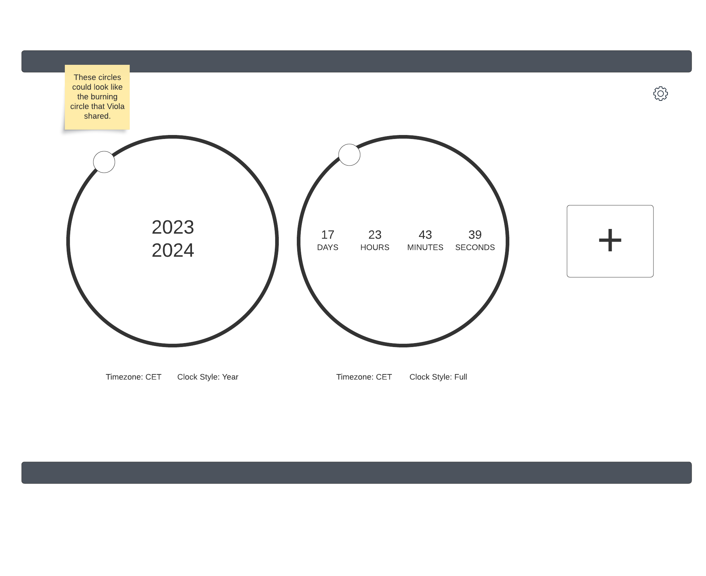

<h1 align="center"><strong> :santa: :christmas_tree: SECRET SANTA: A HOLIDAY HACKATHON :christmas_tree: :santa:</strong></h1>

<h1 align="center"><strong>Loading 2024 ...</strong></h1>

## **Intro**
Welcome to ***Loading 2024 ...*** - your go-to destination for ringing in the new year with style and excitement! As the clock ticks down to midnight, join us on a virtual journey filled with anticipation, joy, and the thrill of a fresh start. Our app is designed to make your New Year's Eve memorable, providing real-time countdowns, vibrant visuals, and a festive atmosphere that will get you in the celebratory spirit.

Whether you're counting down with friends and family or embracing the moment solo, our app is your companion for the final seconds of the year. Get ready to bid farewell to the past and welcome the future with open arms.

Live link: [Loading 2024 ...](https://nacht-falter.github.io/new-years-countdown/)

## **Deployment**

The website was deployed to GitHub pages:

- From this project's [link for repository](https://github.com/nacht-falter/new-years-countdown), go to the **Settings**.
- From the left-hand menu, click on the **Pages**.
- Under the **Source** section, select the **Main** branch from the drop-down menu and click **Save**.
- A message will appear to confirm a successful deployment to GitHub pages and provide the live link.

The project is deployed and can be accessed here: [Loading 2024 ...](https://nacht-falter.github.io/new-years-countdown/)

### Forking the GitHub Repository
- Go to the GitHub repository.
- In the top right hand corner you can click on the fork button.
- This will fork the repository.

## **Planning Stage**

### **Site Goals**

#### Objectives
- Create a responsive website which is easy to navigate
- Create a fun and engaging website for countdown to the New Year
- Create a festive and visually appealing website

#### Problem Statement
- People might want to celebrate the New Year with other people around the world but may not know when it starts in other time zones
- People might want to know how much time is left until the New Year
- People might want to celebrate the New Year with a visually appealing countdown

#### Target Audience
- Anyone interested in celebrating New Year
- Anyone who wants to know how much time is left until the New Year
- Anyone who wants to see when the New Year will start in different time zones

#### Benefits
- Users can see how much time is left until the New Year
- Users can see when the New Year will start in different time zones
- Users can use the website for a fun and engaging way to countdown to the New Year

### **Wireframes**

For this project we made wireframes to help with planning and design. While some changes were made as we went along and ideas were added to our project, original wireframes can be found below:

  
Wireframes

## **Tech**
The following technologies have been used in the project:
- **HTML 5** - Content and Structure
- **CSS 3** - Styling
- **Javascript** - Interactive features
- [Bootstrap](https://getbootstrap.com/) - Responsive layout and styling
- [Font Awesome](https://fontawesome.com/) - Icons
- [Google Fonts](https://fonts.google.com/) - Typography
- [Lucid Chart](https://www.lucidchart.com) - Wireframes
- [Git](https://git-scm.com/) - Version control
- [GitHub](https://github.com) - Version control and deployment
- [Faviconer](http://www.faviconer.com/) - Favicon
- [Avatars](https://openart.ai/) - Creaction with AI our Team Avatar's

## **Credits**
- [PavelTheCoder](https://pajasevi.github.io/CSSnowflakes/) - Snowflake effect

- Credits and thank you to our team ***Jingle Squad*** for great teamwork during the project and effective communication via our Slack channel chat and calls:
  - [Johannes Bernet](https://github.com/nacht-falter)
  - [Dinis Machado](https://github.com/DinisMachado87)
  - [Fernando Gonçalves](https://github.com/Goncalves95)
  - [Yannick Ferenczi](https://github.com/yannickferenczi)
  - [Jamie O'Neill](https://github.com/jamie33o)
  - [Viola Bergere](https://github.com/violaberg)
  - [Vasilica Pavaloi](https://github.com/Vasi012)
